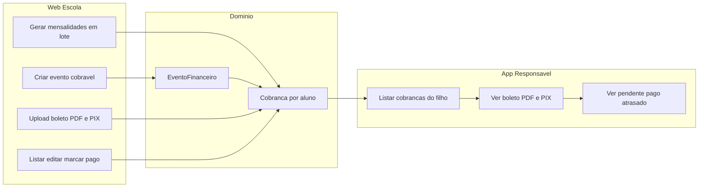

# Módulo Financeiro (Mensalidades + Eventos)

## Premissas (escolhidas a partir do pedido)

- **MVP sem gateway**: a escola sobe o PDF do boleto, informa PIX (copia-e-cola e/ou chave) e **marca como pago manualmente**.
- **Web da escola primeiro**; API do app em seguida (mesmo domínio).
- **Notificação v1**: cobranças aparecem no app (lista pendente/paga). Ao gerar cobrança, a escola pode disparar um **Aviso** ligado aos responsáveis. Push/FCM fica para uma fase posterior (sem implementar agora).
- Seguir os padrões atuais: `tenant_id`, UUIDs, Spatie `escola.financeiro.*`, Actions, Form Requests, Inertia Vue, `ResolveLinkedStudentAction` na API.

Não confundir com **boletim** (notas) nem com SaaS `planos`/`assinaturas` (cobrança da plataforma Edully).

---

## Visão do fluxo

---

## Modelo de dados

Duas entidades principais no schema `escola` (connection `shared`), no mesmo estilo de [`Aviso`](app/Models/Aviso.php) / [`Nota`](app/Models/Nota.php):

### 1. `escola.eventos_financeiros` — template de cobrança de evento

| Campo | Uso |
|-------|-----|
| `tenant_id` | escola |
| `titulo`, `descricao` | ex.: Festa junina, Uniforme |
| `valor` | decimal |
| `vencimento` | date |
| `publico` | `turma` \| `alunos` \| `todos_ativos` |
| `turma_id` | nullable |
| `status` | `rascunho` \| `publicado` \| `encerrado` |
| soft deletes | |

Público específico de alunos: pivot `escola.evento_financeiro_alunos` (`evento_id`, `aluno_id`) **ou** só gerar as cobranças na publicação (preferência: **gerar cobranças na publicação**, sem pivot permanente — mais simples).

### 2. `escola.cobrancas` — unidade cobrada **por aluno** (o que o pai vê)

| Campo | Uso |
|-------|-----|
| `tenant_id`, `aluno_id` | escopo |
| `tipo` | `mensalidade` \| `evento` |
| `evento_financeiro_id` | nullable (FK se tipo evento) |
| `titulo` | “Mensalidade Mar/2026” ou título do evento |
| `descricao` | opcional |
| `referencia` | ex. `2026-03` (mensalidade); útil para unique |
| `valor`, `vencimento` | |
| `status` | `pendente` \| `pago` \| `cancelado` (atrasado = derivado: pendente + vencimento &lt; hoje) |
| `pago_em`, `pago_observacao` | confirmação manual pela escola |
| `boleto_url` | PDF no disk `public` (`financeiro/boletos/...`), padrão dos anexos de avisos |
| `pix_copia_cola`, `pix_chave`, `pix_qrcode_url` | pagamento no app |
| soft deletes | |

**Unique sugerido:** (`tenant_id`, `aluno_id`, `tipo`, `referencia`) onde `referencia` não nula — evita duplicar mensalidade do mesmo mês.

### 3. Config opcional da escola (fase 1.5 ou junto)

Em `tenants` ou tabela `escola.financeiro_config`: PIX padrão da escola para pré-preencher formulários. Não obrigatório no primeiro slice.

---

## Fase 1 — Web da escola (prioridade)

Espelhar Notas/Avisos:

### Permissões e navegação
- Seed: `escola.financeiro.visualizar|criar|editar|excluir` em [`PermissionsAndRolesSeeder`](database/seeders/PermissionsAndRolesSeeder.php) (Administrador Escola).
- Item no [`AppSidebar.vue`](resources/js/components/AppSidebar.vue) + label em [`RoleForm.vue`](resources/js/pages/admin/roles/Partials/RoleForm.vue).

### Telas Inertia (`resources/js/pages/school/financeiro/`)

1. **Index de cobranças** — filtros: tipo, status, turma, aluno, mês/ano; badges pendente/pago/atrasado; ações marcar pago / cancelar.
2. **Gerar mensalidades (lote)** — escolha turma (ou todos), referência (mês/ano), valor, vencimento, PIX padrão, upload boleto opcional (mesmo PDF para todos ou “sem boleto ainda”). Action: `GerarMensalidadesLoteAction` cria uma `Cobranca` por aluno ativo da turma (`matriculas_turma.status = ativo`).
3. **Eventos** — Index/Create/Show: criar evento → ao **publicar**, Action `PublicarEventoFinanceiroAction` gera `Cobranca` por aluno do público alvo.
4. **Show/Edit cobrança** — editar valor/vencimento/PIX, upload/substituir boleto, marcar pago com data/obs.

### Backend
- Controllers: `School/Financeiro/CobrancasController`, `MensalidadesController` (lote), `EventosController`.
- Routes em [`routes/school.php`](routes/school.php) com middleware `permission:escola.financeiro.*`.
- Form Requests + Actions em `app/Actions/School/`.
- Storage: `Storage::disk('public')->store('financeiro/boletos', ...)`, URL em `boleto_url` (igual avisos).

### “Notificar cobrança” na web
- Botão **Notificar responsáveis**: cria um `Aviso` com `publico_alvo = responsaveis`, título/conteúdo da cobrança (e link conceitual “veja no app”). Reusa o módulo de avisos já consumido pelo app — sem push novo.

---

## Fase 2 — API mobile (responsável)

Em [`routes/api.php`](routes/api.php), prefixo `mobile`, auth Sanctum:

| Endpoint | Função |
|----------|--------|
| `GET students/{id}/cobrancas` | lista (filtros `status`, `tipo`, ano) |
| `GET students/{id}/cobrancas/{cobranca}` | detalhe: valor, vencimento, status, `boleto_url`, campos PIX |

- Autorização via [`ResolveLinkedStudentAction`](app/Actions/Api/ResolveLinkedStudentAction.php).
- `CobrancaResource` em `app/Http/Resources/Api/`.
- Resposta no padrão `{ "cobrancas": [...], "meta": {...} }`.
- **Somente leitura** no app no MVP (pai não marca pago; escola confirma).

O app mostra: abas/filtros Pagas / Em aberto; botão abrir PDF; botão copiar PIX.

---

## Fase 3 — Evoluções (fora do MVP, mas já previstas no domínio)

- Gateway (Asaas/Efí): campos `gateway`, `gateway_charge_id`, webhook → `status = pago`.
- Push (FCM/Expo) + device tokens.
- Pai “informar pagamento” (`aguardando_confirmacao`) + escola aprova.
- Relatórios / inadimplência por turma.
- PIX QR gerado a partir do copia-e-cola.

---

## Ordem de implementação sugerida

1. Migrations + models `Cobranca`, `EventoFinanceiro` (+ factories).
2. Permissões, rotas e CRUD web de cobranças unitárias.
3. Geração em lote de mensalidades.
4. Eventos + publicação gerando cobranças.
5. Upload boleto/PIX + marcar pago + notificar via Aviso.
6. API mobile list/show + testes Pest.
7. (Depois) polish UI e relatórios.

---

## Testes (obrigatório por mudança)

Espelhar [`NotasCrudTest`](tests/Feature/School/NotasCrudTest.php) / [`Api/NotasTest`](tests/Feature/Api/NotasTest.php):

- Escola cria lote de mensalidades só para alunos da própria turma/tenant.
- Publicar evento gera N cobranças; tenant isolation 403.
- Marcar pago atualiza `pago_em`.
- API: responsável só vê cobranças de filhos vinculados; não autenticado 401.

---

## Escopo explícito do que NÃO entra no primeiro entregável

- Integração bancária/gateway e conciliação automática.
- Push notification nativo.
- Pagamento “dentro” do app (checkout); só **exibir** boleto + dados PIX.
- Cobrança SaaS Edully (`saas.assinaturas`) — domínio separado.
